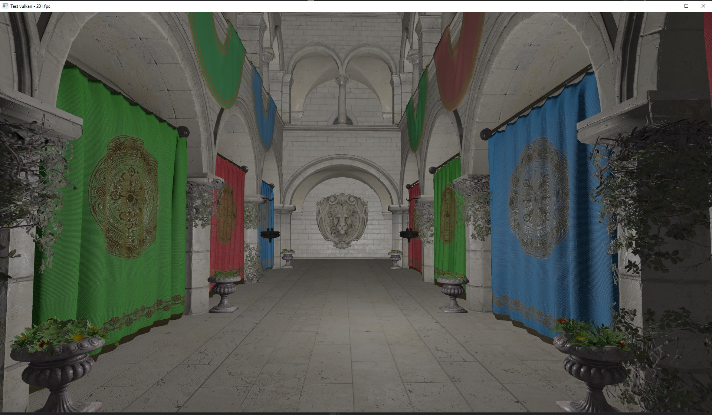

# Vulkan glTF renderer

This project was made to learn the Vulkan API, and more specifically the C++ bindings of Vulkan.

It can render basic glTF 2 models with an incomplete PBR (Physically Based Rendering) implementation.

